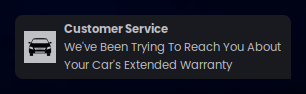
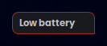
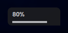

# Dunst
## Note
The notification sits in the bottom-right corner.
I also fork dunst to not round that corner in the notification.

## Preview
### Default

### Urgent

### Bar (volume/brightness)

