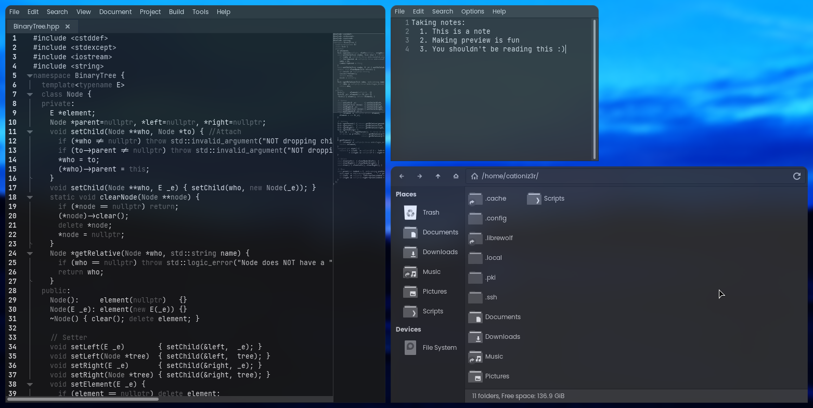

# GTK
## Note
This directory includes entries for both gtk2 and gtk3, as they always changes together.

I used modified version of various themes.
The original ones belong to their respectful creators which you can find more about
.

## Preview

